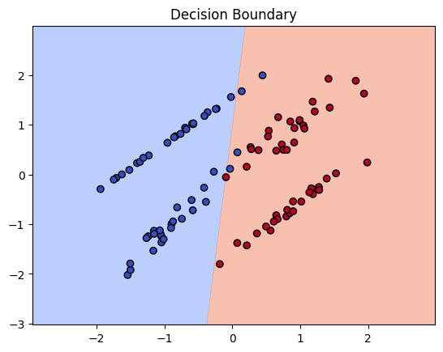

# Logistic Regression using PyTorch

## Overview
This project implements a **Logistic Regression** model using PyTorch to classify synthetic data generated using `sklearn.datasets.make_classification`. The model learns to distinguish between two classes based on two input features.

## Features
- Uses **PyTorch** for model implementation and training.
- Generates synthetic data for classification.
- Implements **gradient descent** for optimization.
- Uses **BCELoss** for binary classification.
- **Plots the decision boundary** after training.

## Dependencies
Ensure you have the following dependencies installed before running the script:

```bash
pip install torch numpy matplotlib scikit-learn
```

## Usage
Run the Python script to train the Logistic Regression model:

```bash
python logistic_regression.py
```

## Implementation Details
1. Generate synthetic classification data using `make_classification`.
2. Normalize the features using `StandardScaler`.
3. Convert the dataset into PyTorch tensors.
4. Define a **Logistic Regression** model with a single linear layer and sigmoid activation.
5. Train the model using **Stochastic Gradient Descent (SGD)**.
6. Display the **decision boundary** after training.

## Logistic Regression Explained

### **1 How It Works**
#### **Step 1: Linear Combination of Inputs**
Like Linear Regression, Logistic Regression first computes a weighted sum of input features:  
```
z = w₁x₁ + w₂x₂ + ... + wₙxₙ + b
```
where:
- `w₁, w₂, ..., wₙ` are the model’s weights  
- `x₁, x₂, ..., xₙ` are input features  
- `b` is the bias term  

#### **Step 2: Sigmoid Activation**
To convert `z` into a probability, we apply the **sigmoid function**:
```
σ(z) = 1 / (1 + e⁻ᶻ)
```
This function maps `z` to a value between **0 and 1**, which can be interpreted as the probability of belonging to class **1**.

#### **Step 3: Decision Rule**
- If `σ(z) ≥ 0.5`, classify as **1 (Positive Class)**  
- If `σ(z) < 0.5`, classify as **0 (Negative Class)**  

### **2 Loss Function: Binary Cross-Entropy**
Logistic Regression uses **Binary Cross-Entropy (Log Loss)** to measure prediction error:
```
Loss = - (1/m) * Σ [yᵢ log(ŷᵢ) + (1 - yᵢ) log(1 - ŷᵢ)]
```
where:  
- `yᵢ` is the actual class label (0 or 1)  
- `ŷᵢ` is the predicted probability  
- `m` is the number of samples  

Cross-entropy loss **penalizes incorrect confident predictions heavily**, encouraging the model to be more accurate.

### **3 Optimization: Gradient Descent**
To minimize loss, we update weights using **Gradient Descent**:
```
w := w - α * (∂Loss / ∂w)
```
where:  
- `α` is the **learning rate**  
- `∂Loss / ∂w` is the **gradient of the loss function**  

### **4 Multi-Class Logistic Regression (Softmax)**
For **multi-class classification**, Logistic Regression is extended using the **Softmax function**, which outputs probabilities for each class.

### **5 When to Use Logistic Regression?**
1. When the **target variable is binary** (e.g., spam vs. not spam, cancer vs. no cancer).  
2. When **interpretability is important** (weights show feature importance).  
3. When **data is linearly separable** (otherwise, advanced models like Neural Networks work better).  

### **6 Key Differences from Linear Regression**
| Feature  | Logistic Regression | Linear Regression |
|----------|---------------------|-------------------|
| **Output** | Probability (0 to 1) | Continuous value |
| **Activation** | Sigmoid | None |
| **Loss Function** | Binary Cross-Entropy | Mean Squared Error |
| **Use Case** | Classification | Regression |

## Visualization
After training, the script generates the following decision boundary graph:




## Example Output

```
Epoch : 9/500, Loss:0.6354324221611023
Epoch : 19/500, Loss:0.6323456168174744
Epoch : 29/500, Loss:0.6292890310287476
...
...
Epoch : 489/500, Loss:0.5162254571914673
Epoch : 499/500, Loss:0.5142671465873718
```

## Author

Brinda Navakumar

## License

This project is licensed under the MIT License.

